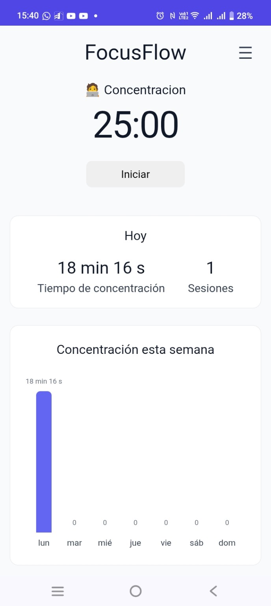
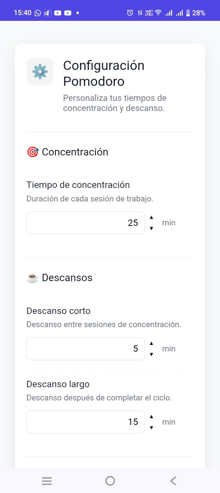
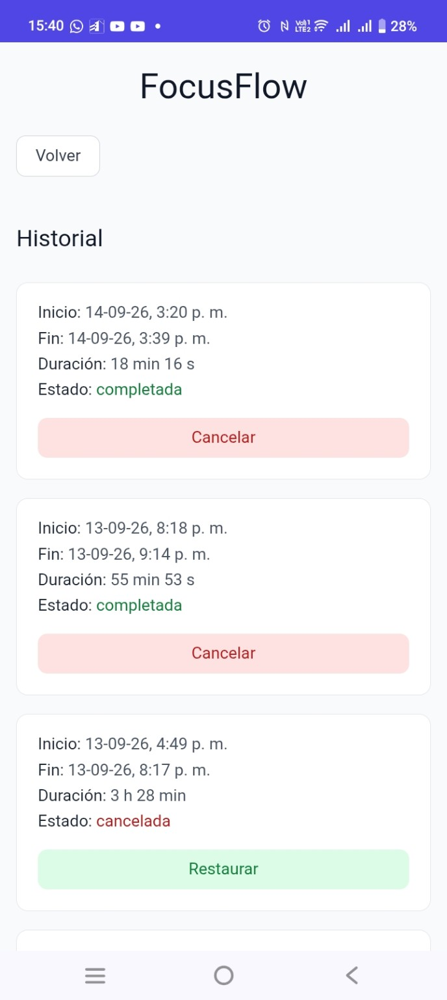

# Concentra

Aplicación web de productividad enfocada en mejorar y medir la concentración mediante sesiones de trabajo basadas en la técnica Pomodoro.

## 🚀 Demo

**Aplicación:** https://focusflow-inky-theta.vercel.app

## 📋 Descripción

Concentra permite registrar sesiones de concentración, configurar períodos de trabajo y descanso y consultar estadísticas e historial para realizar un seguimiento del tiempo dedicado a la concentración.

El proyecto fue desarrollado como una aplicación web full stack y se encuentra desplegado en producción.

## ✨ Funcionalidades

- Registro e inicio de sesión de usuarios.
- Temporizador Pomodoro.
- Configuración personalizada de los períodos de trabajo y descanso.
- Registro de sesiones de concentración.
- Historial de sesiones.
- Estadísticas de concentración.
- Notificaciones al finalizar los períodos del temporizador.
- Progressive Web App (PWA) instalable desde el navegador.

## 🛠️ Tecnologías

### Frontend
- React
- JavaScript
- HTML
- CSS

### Backend
- Node.js
- Express

### Base de datos
- PostgreSQL

### Herramientas
- Git
- GitHub

## 📁 Estructura del proyecto

```text
focusflow/
├── frontend/
├── backend/
├── database/
└── docs/
```

## 📚 Documentación

La carpeta `docs/` contiene la documentación del proyecto, incluyendo la especificación, decisiones de desarrollo y documentación de la API.

## 📌 Estado del proyecto

Proyecto personal en desarrollo continuo.

La aplicación cuenta actualmente con una versión desplegada y funcional en producción.

## 📸 Capturas

### Temporizador y estadísticas


### Configuración Pomodoro


### Historial
